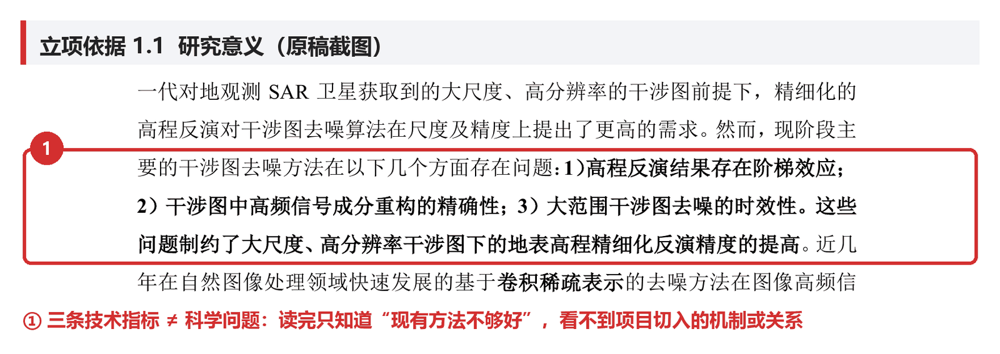
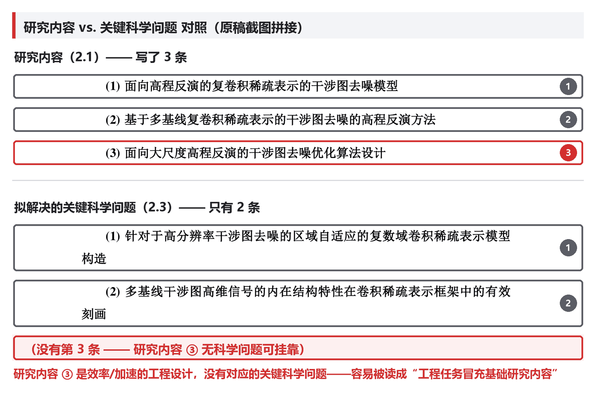
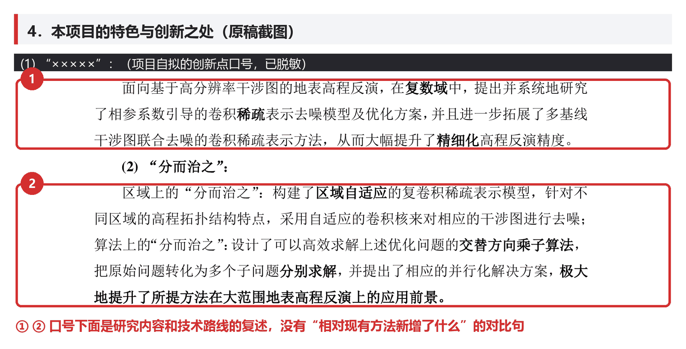
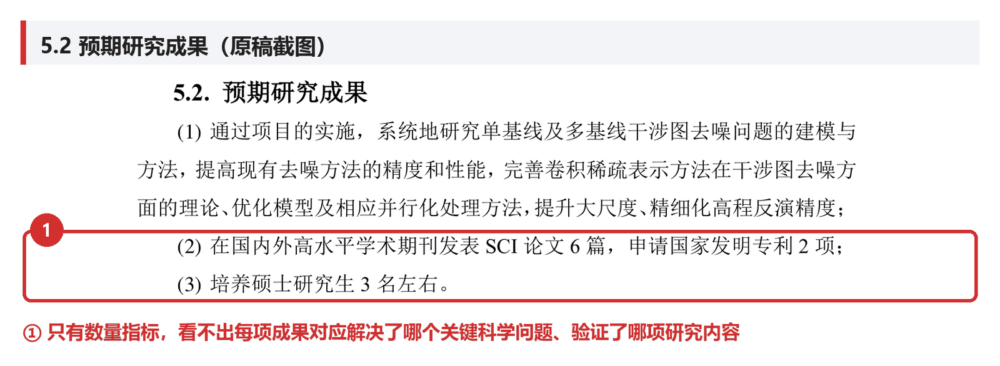

<p align="center">
  
</p>

<h1 align="center">NSFC 本子把脉</h1>

<p align="center">
  <strong>给国自然申请书做一次结构化体检：找逻辑断点，给修改抓手。</strong>
</p>

<p align="center">
  <a href="LICENSE"></a>
  <a href="https://github.com/jiankang1991/nsfc-benzi-audit/commits/main"></a>
  
  
</p>

`nsfc-benzi-audit` 是一个用于国家自然科学基金（NSFC/国自然）申请书初稿诊断的 Agent Skill。它面向已经有草稿的申请人，帮助从题目、摘要、立项依据、关键科学问题、研究内容、创新点、研究基础、图表、文献和形式栏目等角度生成修改建议。

它不是代写工具，不承诺申请成功，也不替代申请人自己的科学判断、同行专家建议、依托单位要求和基金委官方指南。

## 交流群

有问题、有案例、有改进建议，欢迎进群交流使用心得。

<p align="center">
  
</p>

<p align="center">QQ 群：nsfc-skill交流，群号 <strong>1062928117</strong></p>

## 快速开始

```text
Use $nsfc-benzi-audit to audit this NSFC application draft.
```

把申请书 PDF、DOCX、Markdown、纯文本，或核心片段贴给 Agent。若提供已中本子作为对照样本，先做匿名化处理，并说明项目类型、获资助年份、粗略学科/申请代码和研究属性。

## 适用场景

- 青年、面上、地区等项目申请书已有初稿，需要做结构性体检。
- 想检查题目、摘要、关键科学问题和创新点是否互相支撑。
- 想把评审人快速阅读时可能卡住的问题提前暴露出来。
- 想生成一份可执行的“优先修改清单”，而不是泛泛润色。
- 手头有已中/已获资助本子，想在匿名化后提炼可迁移写法规律，用来对照当前草稿。
- 医学、临床或生物医学本子需要额外检查疾病机制、样本/队列、模型体系、伦理、生物安全和转化验证链条。
- 遥感、GIS、地理空间智能、地貌/DEM、点云/三维建模、时空图、视频 GIS 或轨迹/位置数据本子需要额外检查空间对象、数据模态、几何/物理/拓扑约束和验证链条。

## 不适用场景

- 从零代写申请书。
- 编造论文、数据、前期基础、合作单位或实验结果。
- 复制已中本子的原文、未公开思路、数据、图表或保密研究基础。
- 替代当年官方指南、申请系统和单位科研管理部门要求。
- 输出正式通讯评审意见。

## 安装

推荐用 Skills CLI 一行安装。`npx` 会临时运行 npm 上的 `skills` 命令，从 GitHub 拉取本仓库中的 skill；这不要求本项目本身发布成 npm 包。

Codex：

```bash
npx skills add jiankang1991/nsfc-benzi-audit -g -a codex -y
```

Claude Code：

```bash
npx skills add jiankang1991/nsfc-benzi-audit -g -a claude-code -y
```

如果想让 CLI 自动检测本机已安装的 Agent，也可以用：

```bash
npx skills add jiankang1991/nsfc-benzi-audit -g -y
```

没有 Node.js/npx，或网络环境无法访问 GitHub 时，也可以手动安装。将 `nsfc-benzi-audit/` 目录复制到对应 Agent Skills 目录：

```bash
# Codex
mkdir -p ~/.codex/skills
cp -a nsfc-benzi-audit ~/.codex/skills/

# Claude Code
mkdir -p ~/.claude/skills
cp -a nsfc-benzi-audit ~/.claude/skills/
```

然后在对话中使用：

```text
Use $nsfc-benzi-audit to audit this NSFC application draft.
```

## 推荐输入

最小输入可以是一段申请书核心内容：

```markdown
项目类型：青年 / 面上 / 地区
研究属性：自由探索类基础研究 / 目标导向类基础研究 / 不确定
申请代码：
题目：
摘要：
研究内容：
研究目标：
拟解决的关键科学问题：
特色与创新之处：
研究基础简述：
你最担心的问题：
```

若提供已中本子作为对照样本，建议同时说明项目类型、获资助年份、粗略学科/申请代码、研究属性，并先去除姓名、单位、项目编号、联系方式、未公开数据和敏感成果。

也可以输入 PDF、DOCX、Markdown、纯文本，或从 PDF 转出的文本/Markdown。若涉及真实申请书，注意不要公开个人信息、项目编号、未公开数据、合作单位和敏感成果。

## 输出内容

默认输出一份 Markdown 诊断报告，通常包括：

- 总体判断
- 一页逻辑图
- 优先修改清单
- 分章节诊断
- 形式与栏目完整性
- 图表与可读性
- 数据、验证与研究基础映射
- 文献与研究现状
- 政策与科研诚信
- 信息通信类专项检查（如适用）
- 遥感/GIS/地理空间专项检查（如适用）
- 医学、伦理与样本链条（如适用）
- 一致性矩阵
- 中标样本对照（如提供）
- 摘要、关键科学问题、创新点的改写骨架
- 官方规则核查状态与诊断限制

## 示例

示例文件在 `examples/`：

- `mini-draft.md`：一个本子核心片段示例。
- `mini-report.md`：对应的诊断报告示例。

## 文件结构

```text
nsfc-benzi-audit/
├── SKILL.md
├── agents/openai.yaml
├── assets/report-template.md
└── references/
    ├── benzi-logic.md
    ├── audit-surfaces.md
    ├── information-communication.md
    ├── geospatial-remote-sensing.md
    ├── medical-biomedical.md
    ├── exemplar-learning.md
    └── current-rules.md
```

`SKILL.md` 负责触发和工作流，`references/` 存放诊断判据，`assets/report-template.md` 是默认报告结构。

## 修改示例

下面是几个常见修改例子，展示这个 skill 会从哪些角度给出建议。

| 覆盖能力 | 修改前 | 修改后 | 针对性意见和建议 |
| --- | --- | --- | --- |
| 题目聚焦 | 面向复杂场景的多源智能感知与高效识别方法研究 | 面向[具体场景]的[研究对象]跨源表征与[核心科学问题]研究 | 题目不要同时堆入场景、技术、应用和效果。优先保留“对象/场景 + 问题 + 方法路径”，删去泛化形容词。 |
| 摘要逻辑链 | 本项目拟研究 A、B、C 三类方法，提升精度和效率，具有重要意义。 | 针对[对象]在[场景]中存在的[科学障碍]，拟从[机理/模型]入手，开展三项研究，阐明[关键关系]，形成[可验证结果]。 | 摘要应先让评审看到科学问题，再列研究内容；避免写成任务清单或效果承诺。 |
| 关键科学问题 | 如何构建高精度模型并提升识别效果？ | [变量/机制]如何影响[对象]的[表征/耦合/演化]，以及这种关系如何约束[模型或方法]？ | 把“做一个模型”改成可研究、可验证的机制或关系问题。技术路线可以解决问题，但不应替代科学问题。 |
| 研究内容衔接 | 研究数据构建、模型设计、平台实现和实验验证。 | 内容一回答[机制问题]；内容二建立[模型方法]；内容三在[场景]中验证[假设与边界]。 | 研究内容要逐项回应关键科学问题，形成“问题-内容-方法-验证”的闭环，避免工程流程堆叠。 |
| 创新点表达 | 首次提出某方法，显著提升性能，填补研究空白。 | 创新在于：将已有[方法/理论]从[已有条件]推进到[项目条件]，并通过[约束/机制/验证]解决[现有缺口]。 | 少用“首次、显著、填补空白”等口号。说明相对现有研究的新变量、新关系、新证据或新适用边界。 |
| 研究基础映射 | 申请人发表多篇论文，研究基础扎实，能够保障项目完成。 | 前期工作 1 支撑内容一；前期工作 2 支撑内容二；仍需补充[缺口]的预实验或对比验证。 | 研究基础不要只罗列成果，要映射到每个研究内容；主动暴露还需补强的证据，反而更可信。 |
| 文献与形式核查 | 国内外研究很多，现有方法仍有不足；申请代码和研究属性未在正文中呼应。 | 每个研究现状小节以“已有研究解决了什么、在本项目条件下还缺什么、因此引出哪项内容”收束；正文术语与申请代码、研究属性保持一致。 | 文献综述要服务立项依据，不只是证明读过文献。形式/政策问题只提示申请人按当年指南和系统核查，不替代官方判断。 |

## 真实案例：一份青年基金申请书的修改片段

下面四段是一份真实青基申请书初稿的原文截图（红框和红字是 skill 给出的标注），每段后面附上对应的修改建议。

### 案例一：立项依据把技术指标当成了科学问题



| | |
| --- | --- |
| **修改前** | 然而，现阶段主要的干涉图去噪方法在以下几个方面存在问题：1）……阶梯效应；2）……重构的精确性；3）……去噪的时效性。这些问题制约了……精度的提高。 |
| **修改后** | ……存在阶梯效应、重构精度不足、时效性欠佳三个问题。**本质上，这三条可归结为[某类先验/约束]与[结果保真度]之间尚未被显式建模的关系——这正是本项目切入的科学问题。** |
| **意见** | 三条技术指标是"现有方法不够好"的证据，不是科学问题本身。清单后面需要补一句"归结句"，把并列指标收束成一个可研究、可检验的关系陈述，否则读者读完整段仍不知道项目要研究什么机制。 |

### 案例二：研究内容 3 条，关键科学问题只有 2 条



| | |
| --- | --- |
| **修改前** | 研究内容写了 (1)(2)(3) 三条，其中 (3) 是"面向大尺度……的优化算法设计"；而 2.3 节的关键科学问题只列了 (1)(2) 两条，写完直接进入第 3 节。 |
| **修改后** | 二选一：**补第 (3) 条科学问题**——[精度]与[计算复杂度]之间是否存在可刻画的内在权衡关系；或者**把研究内容 (3) 降级**，并入内容 (1)(2) 作为其验证/实现环节。 |
| **意见** | 条数不匹配评审一眼就能数出来。内容 (3) 本质是工程实现和加速，挂不到任何科学问题下，最容易被判成"工程任务冒充基础研究内容"。改完要保证每条研究内容都能回溯到某条关键科学问题。 |

### 案例三：创新点写成了口号 + 研究内容复述



| | |
| --- | --- |
| **修改前** | (1)"×××××"：面向……，在复数域中，提出并系统地研究了……模型及优化方案，并且进一步拓展了……方法，从而大幅提升了……精度。(2)"分而治之"：构建了区域自适应的……模型；设计了……算法，把原始问题转化为多个子问题分别求解…… |
| **修改后** | 小标题保留作记忆点，正文每条补一句：**创新在于将[已有方法/理论]从[已有适用条件]推进到[本项目新增条件]，通过[新引入的先验/约束]解决了[现有方法留下的具体缺口]。** |
| **意见** | 对仗小标题本身没问题，问题在于正文全是研究内容和技术路线的再叙述，通篇没有"相对现有方法新增了哪个变量、哪个关系、哪条证据、哪个适用边界"的对比句。创新点段落于是等于研究内容摘要的重复，不构成独立的评审依据。 |

### 案例四：预期成果只有数量指标



| | |
| --- | --- |
| **修改前** | (2) 在国内外高水平学术期刊发表 SCI 论文 6 篇，申请国家发明专利 2 项；(3) 培养硕士研究生 3 名左右。 |
| **修改后** | **成果一**对应关键科学问题 (1)：形成[理论/模型]并发表；**成果二**对应关键科学问题 (2)：形成[方法]并申请专利；**成果三**：三项研究内容在[场景]上完成可复现的验证基准。 |
| **意见** | 论文数、专利数、学生数是任务指标，不是科学产出。按科学问题拆分成果，评审才能确认"这个项目做完之后，前面提的问题各自被回答到什么程度"。 |

### 其他章节的同类问题

| 章节 | 修改前 | 修改后 | 意见 |
| --- | --- | --- | --- |
| 拟解决的关键科学问题 | 一方面……另一方面……最后……因此，如何构建适用于本场景的自适应模型，是本项目拟解决的关键科学问题之一。 | [某类条件/变量]如何影响[目标对象]的[某种关系/边界]，从而约束了自适应模型的设计。 | 结尾句是"建一个模型"的技术任务句式，不是变量间关系的可研究问题。三条铺垫事实压缩成一句背景，问题句独立成句、可检验。 |
| 可行性分析 | 方法上的可行性：申请人在[方向]积累了经验，相关成果得到了[合作者]的肯定，发表在[期刊]上…… | 前期工作已验证[某子问题]在[受限条件]下可行；本项目需在[新条件]下重新验证[关键假设]，这部分目前缺少预实验，将在第一年完成。 | 超过一半篇幅在罗列期刊、合作背景和已获认可，写成了履历陈述。应逐条对应技术路线里的关键技术点，说明"已具备"和"仍需补充"各占多少——主动暴露缺口反而更可信。 |

## 设计原则

- 只做诊断和修改建议，不做事实编造。
- 区分“写作逻辑风险”和“官方规则风险”。
- 对政策、资格、AI 使用声明、伦理、安全、预算等问题，以当年 NSFC 官方指南为准。
- 对 OCR 或格式提取错误保持谨慎，不把文本提取问题直接归责给申请人。

## 免责声明

- 本项目仅供学习、研究和申请书自查参考，不保证申请成功。
- 使用者必须遵守 NSFC 科研诚信要求和 AI 使用规范。
- 不应用 AI 直接生成申请书；所有 AI 辅助内容都必须由申请人逐项核实、修改和负责。
- 政策、申请条件、格式要求和申报规则以基金委当年官方指南和申请系统为准。
